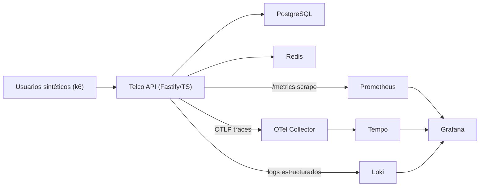

# Telco Reliability Lab

**Portfolio de ingeniería de rendimiento y fiabilidad (SDET / Quality Engineering).**
Una API de autogestión telco realista, instrumentada de extremo a extremo, con una
suite de pruebas de rendimiento k6, un stack de observabilidad Grafana completo,
inyección de fallos controlada y quality gates de CI capaces de bloquear un despliegue
por criterios de fiabilidad.

> El entregable no es la carga — son las **decisiones**: SLOs defendibles, la prueba
> correcta para cada riesgo y la observabilidad suficiente para depurar bajo presión.

**Demo en vivo:** [telco-web.onrender.com](https://telco-web.onrender.com) · API: [telco-api.onrender.com/health](https://telco-api.onrender.com/health)
_(free tier — el primer request tras inactividad puede tardar ~30 s)_

---

## Qué incluye

- **Sistema bajo prueba** — API Fastify + TypeScript con los cuatro flujos de mayor riesgo
  en telco: login, consulta de facturas, cambio de plan y **pago con idempotencia
  aplicada a nivel de base de datos**.
- **Suite de rendimiento** — Perfiles k6: smoke, load, stress, spike, soak y un
  ejercicio de **degradación** autocontenido. Umbrales SLO por journey.
- **Observabilidad** — Métricas RED + negocio (Prometheus), trazas distribuidas
  (OpenTelemetry → Collector → Tempo), logs estructurados con `trace_id` (Loki) y
  Grafana configurado para correlación métrica → traza → log.
- **Inyección de fallos** — Inyecta latencia / errores / timeouts en tiempo de ejecución
  para impulsar la demo de degradación (gated por env; sólo para laboratorio).
- **Pruebas funcionales** — Tests de integración API con Playwright que cubren guards de
  autenticación, validación de esquema, control de acceso a facturas y el **invariante
  de idempotencia de pagos** (la misma `Idempotency-Key` nunca debe generar un segundo
  cargo).
- **Alertas** — Reglas de alerta Prometheus para cada SLO (p95 por journey + tasa de
  error + API caída); Alertmanager enruta webhook → `POST /admin/alerts` en la propia
  API, de modo que las alertas activas aparecen en Loki junto a las trazas — sin
  dependencias externas.
- **Especificación OpenAPI 3.1** — `docs/openapi.yaml` documenta cada endpoint con
  esquemas de petición y respuesta; validado con Redocly en CI como quality gate.
- **CI/CD** — GitHub Actions y GitLab CI: typecheck + pruebas unitarias + lint OpenAPI +
  tests Playwright + k6 smoke como quality gates; stress/spike/soak programados con
  comparación regresión entre ejecuciones y escaneo pasivo OWASP ZAP.

## Arquitectura



Detalles y decisiones de diseño: [`docs/architecture.md`](docs/architecture.md).

## Inicio rápido

Requiere Docker + Docker Compose.

```bash
# 1. Levantar todo el stack (API + Postgres + Redis + OTel + Tempo + Loki + Prometheus + Grafana)
docker compose up -d --build

# 2. Smoke-test del sistema (bloqueante si se incumplen umbrales SLO)
docker compose run --rm k6 run /scripts/scenarios/smoke.js

# 3. Explorar
#    Web UI     http://localhost:8080   (portal de autogestión demo)
#    API        http://localhost:3000/health
#    Métricas   http://localhost:3000/metrics
#    Grafana    http://localhost:3001   (visor anónimo; admin/admin para editar)
#    Prometheus http://localhost:9090
```

Grafana incluye cuatro dashboards aprovisionados (carpeta **Telco Reliability Lab**):
**API — RED**, **SLO Overview**, **k6 Test Run** y **Reliability & Degradation**.

### Verificar todo el stack en un solo comando

```bash
./scripts/verify-stack.sh --up    # levanta y verifica cada componente + ejecuta k6 smoke
```

Valida salud de API/DB/Redis, que Prometheus está scrapeando la API, disponibilidad de
Tempo/Loki, aprovisionamiento de Grafana y que el perfil smoke supera sus SLOs —
sale con error si algo falla.

### Ejecutar los otros perfiles

```bash
docker compose run --rm k6 run /scripts/scenarios/load.js
docker compose run --rm k6 run /scripts/scenarios/stress.js
docker compose run --rm k6 run /scripts/scenarios/spike.js
docker compose run --rm k6 run /scripts/scenarios/degradation.js   # inyecta y limpia un fallo
```

### La demo de incidente en 3 clics

Ejecuta `degradation.js` y sigue
[`docs/observability-guide.md`](docs/observability-guide.md): Grafana muestra el p95
de pagos rompiendo el presupuesto → abre una traza lenta en Tempo → el tiempo está en
`payment-gateway-simulator` → haz clic en los logs Loki correlacionados por `trace_id`.
Métrica → traza → log, en tres clics.

## Endpoints

| Método | Ruta | Notas |
|---|---|---|
| POST | `/auth/login` | Devuelve un JWT + `customerId` |
| GET | `/customers/:customerId/invoices` | Requiere auth; sólo datos propios |
| POST | `/customers/:customerId/plan-changes` | Requiere auth; devuelve `202 scheduled` |
| POST | `/payments` | Auth + cabecera `Idempotency-Key`; idempotencia aplicada en DB |
| GET | `/health` · `/health/live` | Disponibilidad (dependencias) · Liveness |
| GET | `/metrics` | Exposición Prometheus |
| POST/GET/DELETE | `/admin/faults` | Inyección de fallos (gated por env) |
| POST | `/admin/alerts` | Receptor webhook de Alertmanager — registra alertas activas en Loki |

Contrato completo: [`docs/openapi.yaml`](docs/openapi.yaml) (OAS 3.1, validado con Redocly).

## SLOs (aplicados por umbrales k6)

| Journey | Objetivo p95 | Tasa de error |
|---|---:|---:|
| Login | < 600 ms | < 1% |
| Consulta de facturas | < 800 ms | < 1% |
| Cambio de plan | < 1200 ms | < 1,5% |
| Pago | < 1500 ms | < 1% |
| **Global** | **< 1200 ms** | **< 1%**, checks **> 99%** |

Justificación: [`docs/slo-definition.md`](docs/slo-definition.md).

## Tests de integración API (Playwright)

La suite `tests/api/` usa `APIRequestContext` de Playwright — sin navegador, HTTP puro.
Se ejecuta contra el stack en vivo y valida:

| Fichero | Qué cubre |
|---|---|
| `health.spec.ts` | Liveness `/health/live`, readiness `/health` (dependencias DB + Redis) |
| `auth.spec.ts` | Login correcto, contraseña incorrecta → 401, validación de esquema → 400, sin enumeración de usuarios |
| `invoices.spec.ts` | Lista autenticada, sin token → 401, acceso entre clientes → 403 |
| `plan-changes.spec.ts` | Programar → 202, mismo plan → 422, acceso entre clientes → 403 |
| `payments.spec.ts` | `Idempotency-Key` ausente → 400, acceso entre clientes → 403, **replay idempotente → mismo `paymentId`** |

```bash
make up          # levantar el stack
make api-test    # ejecutar todos los tests Playwright API
make api-test-report  # abrir el informe HTML
```

El test de idempotencia (⭐ en la salida) es el más crítico: demuestra que un reintento
de red no puede cobrar dos veces a un cliente verificando que dos llamadas `POST /payments`
idénticas con la misma clave devuelven el mismo `paymentId`.

## Desarrollo local (API sin Docker)

```bash
cd apps/api
npm install
npm run typecheck && npm test        # comprobación estática + tests unitarios
npm run dev                          # requiere Postgres + Redis locales (ver .env.example)
```

Regenerar datos de prueba: `node infra/postgres/generate-seed.mjs`.

## Estructura del proyecto

```
apps/api/              API Fastify TypeScript (sistema bajo prueba) + tests unitarios (Vitest)
apps/web/              UI demo de autogestión (SPA estática, nginx hace reverse-proxy de /api)
tests/api/             Tests de integración API con Playwright (sin navegador — HTTP puro)
tests/k6/              Suite de rendimiento: escenarios, perfiles, umbrales, helpers
tests/zap/             Informes de escaneo pasivo OWASP ZAP (generados; en .gitignore)
observability/
  prometheus/          prometheus.yml + alert-rules.yml (reglas de incumplimiento SLO)
  alertmanager/        alertmanager.yml (webhook → /admin/alerts en la API)
  grafana/             4 dashboards como código (RED, k6 run, SLO overview, fiabilidad)
  otel-collector/      Configuración del OTel Collector
  tempo/ loki/         Backends de trazas y logs
infra/postgres/        Esquema + semilla sintética determinista
scripts/               verify-stack.sh, compare-runs.js, zap-smoke.sh, generate-report.js
docs/                  openapi.yaml (OAS 3.1), arquitectura, SLOs, estrategia, runbook, entrevista
.github/ · .gitlab-ci  CI: build + spec-lint + Playwright + k6 smoke gates; diagnósticos programados + ZAP
docker-compose.yml     Entorno reproducible en un comando (incluye Alertmanager)
playwright.config.ts   Configuración Playwright (tests API, sin navegador)
```

## Documentación

- [Resumen ejecutivo](docs/executive-overview.md) ← empezar aquí para audiencias no técnicas
- [Arquitectura y decisiones](docs/architecture.md)
- [SLOs, SLIs y umbrales](docs/slo-definition.md)
- [Estrategia de pruebas de rendimiento](docs/performance-strategy.md)
- [Pruebas de fiabilidad (idempotencia y fallos)](docs/reliability-testing.md)
- [Guía de observabilidad (métrica → traza → log)](docs/observability-guide.md)
- [Esquema de base de datos](docs/database-schema.md)
- [Catálogo de errores API](docs/error-codes.md)
- [Guía de deploy (demo público gratuito)](docs/DEPLOY.md)
- [Guión de entrevista técnica](docs/interview-walkthrough.md)

## Hoja de ruta

k6 en Kubernetes (k6-operator), ArgoCD/GitOps, Alertmanager → webhook real de
PagerDuty/Slack en un entorno de staging.

## Aviso

Proyecto de portfolio. Todos los datos son **sintéticos**; sin credenciales reales.
La inyección de fallos y el secreto JWT de demo son exclusivamente para uso local y en CI.
