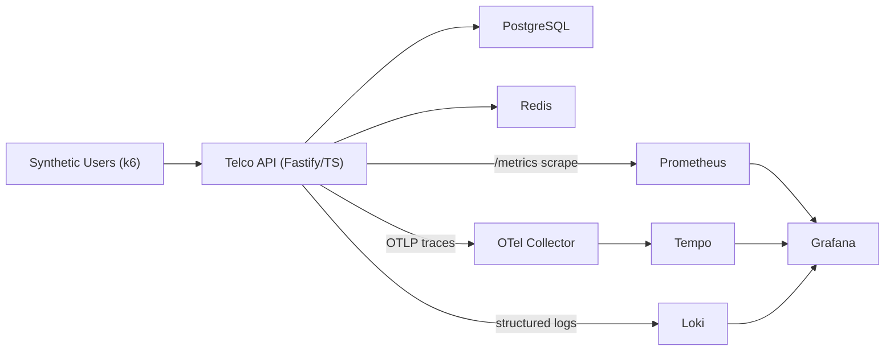

# Telco Reliability Lab

**A performance & reliability engineering portfolio (SDET / Quality Engineering).**
A realistic telco self-management API, instrumented end-to-end, with a k6
performance suite, a full Grafana observability stack, controlled fault
injection, and CI quality gates that can block a release on reliability.

> The deliverable isn't load — it's **decisions**: defendable SLOs, the right
> test for each risk, and observability good enough to debug under pressure.

---

## What's in the box

- **System under test** — Fastify + TypeScript API with the four highest-risk
  telco journeys: login, invoice lookup, plan change, and **payment with
  database-enforced idempotency**.
- **Performance suite** — k6 profiles: smoke, load, stress, spike, soak, and a
  self-contained **degradation** drill. Per-journey SLO thresholds.
- **Observability** — RED + business metrics (Prometheus), distributed traces
  (OpenTelemetry → Collector → Tempo), structured logs with `trace_id` (Loki),
  and Grafana wired for metric → trace → log correlation.
- **Fault injection** — inject latency / errors / timeouts at runtime to drive
  the degradation demo (env-gated; lab only).
- **Functional tests** — Playwright API integration tests covering auth guards, schema validation, invoice access control, and the **payment idempotency invariant** (same `Idempotency-Key` must never produce a second charge).
- **Alerting** — Prometheus alert rules for each SLO (per-journey p95 + error rate + API down); Alertmanager routes webhook → `POST /admin/alerts` on the API itself, so firing alerts appear in Loki alongside traces — no external dependencies needed.
- **OpenAPI 3.1 spec** — `docs/openapi.yaml` documents every endpoint with request/response schemas; linted with Redocly in CI as a quality gate.
- **CI/CD** — GitHub Actions and GitLab CI: typecheck + unit tests + OpenAPI lint + Playwright API tests + k6 smoke as quality gates; scheduled stress/spike/soak with run-to-run regression comparison and OWASP ZAP passive scan.

## Architecture



Details and design trade-offs: [`docs/architecture.md`](docs/architecture.md).

## Quickstart

Requires Docker + Docker Compose.

```bash
# 1. Boot the whole stack (API + Postgres + Redis + OTel + Tempo + Loki + Prometheus + Grafana)
docker compose up -d --build

# 2. Smoke-test the system (gates on SLO thresholds)
docker compose run --rm k6 run /scripts/scenarios/smoke.js

# 3. Explore
#    Web UI     http://localhost:8080   (demo self-management portal)
#    API        http://localhost:3000/health
#    Metrics    http://localhost:3000/metrics
#    Grafana    http://localhost:3001   (anonymous viewer; admin/admin to edit)
#    Prometheus http://localhost:9090
```

Grafana ships four provisioned dashboards (folder **Telco Reliability Lab**):
**API — RED**, **SLO Overview**, **k6 Test Run**, and **Reliability & Degradation**.

### Verify the whole stack in one command

```bash
./scripts/verify-stack.sh --up    # boots, then checks every component + runs k6 smoke
```

It validates API/DB/Redis health, that Prometheus is scraping the API, Tempo/Loki
readiness, Grafana provisioning, and that the smoke profile passes its SLOs —
exiting non-zero if anything is wrong.

### Run the other profiles

```bash
docker compose run --rm k6 run /scripts/scenarios/load.js
docker compose run --rm k6 run /scripts/scenarios/stress.js
docker compose run --rm k6 run /scripts/scenarios/spike.js
docker compose run --rm k6 run /scripts/scenarios/degradation.js   # injects + clears a fault
```

### The 3-click incident demo

Run `degradation.js`, then follow
[`docs/observability-guide.md`](docs/observability-guide.md): Grafana shows
payment p95 breaching budget → open a slow trace in Tempo → the time is in
`payment-gateway-simulator` → click through to the correlated Loki logs by
`trace_id`. Metric → trace → log, in three clicks.

## Endpoints

| Method | Path | Notes |
|---|---|---|
| POST | `/auth/login` | Returns a JWT + `customerId` |
| GET | `/customers/:customerId/invoices` | Auth required; own data only |
| POST | `/customers/:customerId/plan-changes` | Auth required; returns `202 scheduled` |
| POST | `/payments` | Auth + `Idempotency-Key` header; DB-enforced idempotency |
| GET | `/health` · `/health/live` | Readiness (deps) · liveness |
| GET | `/metrics` | Prometheus exposition |
| POST/GET/DELETE | `/admin/faults` | Fault injection (env-gated) |
| POST | `/admin/alerts` | Alertmanager webhook receiver — logs firing alerts to Loki |

Full contract: [`docs/openapi.yaml`](docs/openapi.yaml) (OAS 3.1, validated with Redocly).

## SLOs (gated by k6 thresholds)

| Journey | p95 target | Error rate |
|---|---:|---:|
| Login | < 600 ms | < 1% |
| Invoice lookup | < 800 ms | < 1% |
| Plan change | < 1200 ms | < 1.5% |
| Payment | < 1500 ms | < 1% |
| **Global** | **< 1200 ms** | **< 1%**, checks **> 99%** |

Rationale: [`docs/slo-definition.md`](docs/slo-definition.md).

## API integration tests (Playwright)

The `tests/api/` suite uses Playwright's `APIRequestContext` — no browser, pure HTTP. It runs against the live stack and validates:

| File | What it covers |
|---|---|
| `health.spec.ts` | `/health/live` liveness, `/health` readiness (DB + Redis deps) |
| `auth.spec.ts` | Login happy path, wrong password → 401, schema validation → 400, no user enumeration |
| `invoices.spec.ts` | Authenticated list, no token → 401, cross-customer → 403 |
| `plan-changes.spec.ts` | Schedule → 202, same plan → 422, cross-customer → 403 |
| `payments.spec.ts` | Missing `Idempotency-Key` → 400, cross-customer → 403, **idempotent replay → same `paymentId`** |

```bash
make up          # boot the stack
make api-test    # run all Playwright API tests
make api-test-report  # open the HTML report
```

The idempotency test (⭐ in test output) is the most critical: it proves a network retry cannot double-charge a customer by verifying that two identical `POST /payments` calls with the same key return the same `paymentId`.

## Local development (API without Docker)

```bash
cd apps/api
npm install
npm run typecheck && npm test        # static check + unit tests
npm run dev                          # needs local Postgres + Redis (see .env.example)
```

Regenerate seed data: `node infra/postgres/generate-seed.mjs`.

## Project layout

```
apps/api/              Fastify TypeScript API (system under test) + unit tests (Vitest)
apps/web/              Demo self-management UI (static SPA, nginx reverse-proxies /api)
tests/api/             Playwright API integration tests (no browser — pure HTTP)
tests/k6/              Performance suite: scenarios, profiles, thresholds, helpers
tests/zap/             OWASP ZAP passive scan reports (generated; gitignored)
observability/
  prometheus/          prometheus.yml + alert-rules.yml (SLO breach rules)
  alertmanager/        alertmanager.yml (webhook → API /admin/alerts)
  grafana/             4 dashboards as code (RED, k6 run, SLO overview, reliability)
  otel-collector/      OTel Collector config
  tempo/ loki/         Trace + log backends
infra/postgres/        Schema + deterministic synthetic seed
scripts/               verify-stack.sh, compare-runs.js, zap-smoke.sh, generate-report.js
docs/                  openapi.yaml (OAS 3.1), architecture, SLOs, strategy, runbook, interview
.github/ · .gitlab-ci  CI: build + spec-lint + Playwright + k6 smoke gates; scheduled diagnostic + ZAP
docker-compose.yml     One-command reproducible environment (includes Alertmanager)
playwright.config.ts   Playwright config (API tests, no browser)
```

## Documentation

- [Executive overview](docs/executive-overview.md) ← start here for non-technical audiences
- [Architecture & decisions](docs/architecture.md)
- [SLOs, SLIs & thresholds](docs/slo-definition.md)
- [Performance testing strategy](docs/performance-strategy.md)
- [Reliability testing (idempotency & faults)](docs/reliability-testing.md)
- [Observability guide (metric → trace → log)](docs/observability-guide.md)
- [Database schema](docs/database-schema.md)
- [API error catalog](docs/error-codes.md)
- [Interview walkthrough](docs/interview-walkthrough.md)

## Roadmap

k6 on Kubernetes (k6-operator), ArgoCD/GitOps, Alertmanager → PagerDuty/Slack
webhook in a real staging environment.

## Disclaimer

Portfolio project. All data is **synthetic**; no real credentials. Fault
injection and the demo JWT secret are for local/CI use only.
